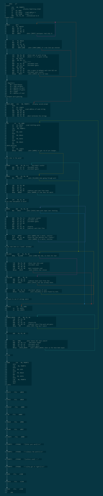

# ALFAT
Assembly Language Flowchart and Analysis Tool, developed by students at the University of Massachusetts Dartmouth.

## Overview
This tool's main use is for the analysis of assembly and assembly-like languages. Languages can be specified by creating a `.json` file describing the operators of the language. See the `CodeSyntax/LC3.json` file for example. 

## Installation
To build the current version, first download the repository. After opening it in your IDE of choice, build `EngineTester` as a .jar file. If all dependencies are installed, this should build a stand-alone version of the program.

To import and build in Eclipse, there is a step-by-step PDF [here](https://drive.google.com/file/d/1py5uuGi124NZxXoda55RIfh6BKzsI1nw/view?usp=sharing).

## Usage

1. Open ALFAT.
2. Open a file: `File > Open File`
3. Build flowchart from file: `File > Generate Flowchart`
4. Switch between views: `File > Flowchart/Splitscreen/Text editor view`
5. Build flowchart from other sources: `File > Build from ... `
6. Highlight register usage: `Registers > (register name)`
7. Highlight broken jump statements: `Analysis > Invalid Labels`

